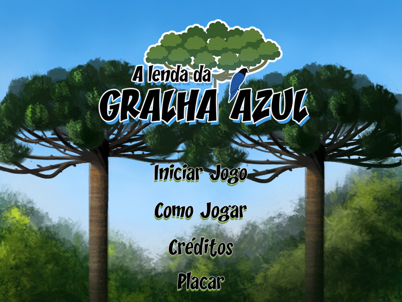
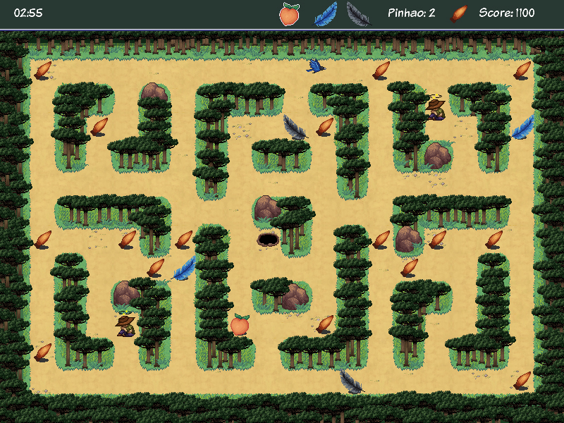
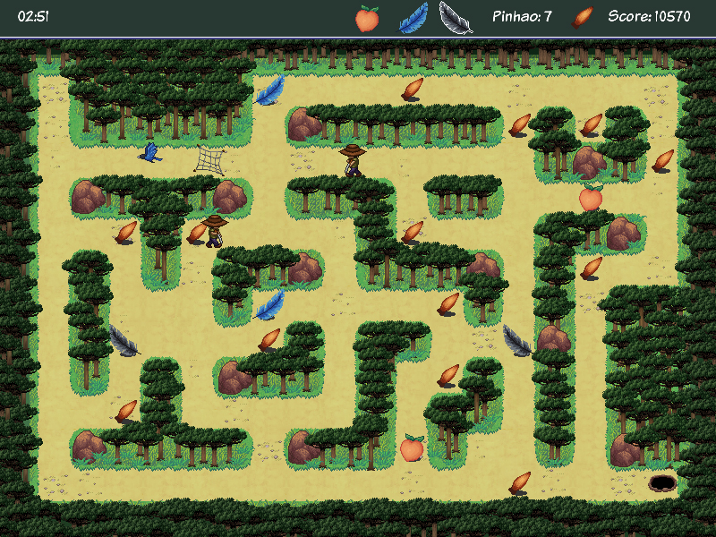
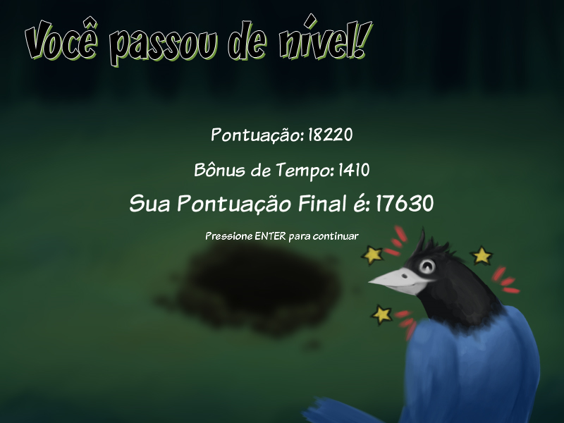
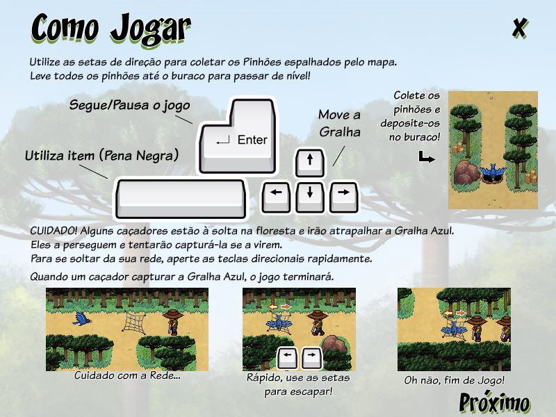
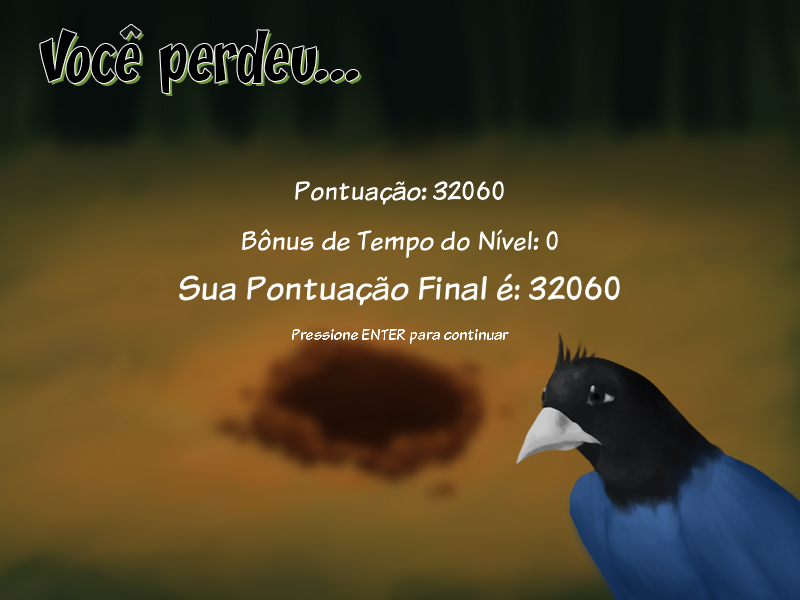

# A Lenda da Gralha Azul

Made with Processing

[PT] Jogo desenvolvido para o Inter do 2º Semestre do curso de Design de Games da Anhembi Morumbi. Variação do clássico Pac-Man inspirado no conto “A Lenda da Gralha Azul” e desenvolvido no Processing.

[EN] Game developed for 2º Semester of Game Design course at Anhembi Morumbi. A variation from the classic Pac-Man game inspired by the “A Lenda da Gralha Azul” tale and developed in Processing.

## Gameplay Video

A Lenda da Gralha Azul gameplay video: https://youtu.be/9Ck7hdQdPMQ

## Screenshots

## Build

Link to download: https://drive.google.com/open?id=1TDXXosS1G8KyYNhGchKLzHY3BIpxXl8d

## Authors
- **Rafael Taue** - Game Designer and Programmer - [GitHub](https://github.com/rtaue) - [Porfolio](https://rtaue.com) - [LinkedIn](https://www.linkedin.com/in/rtaue/)
- **Laís Rodrigues** - Game Designer and Artist - [ArtStation](https://www.artstation.com/marim) - [LinkedIn](https://www.linkedin.com/in/la%C3%ADs-rodrigues-548261149/)
- **Graziela Andreatta** - Game Designer and Level Designer - [LinkedIn](https://www.linkedin.com/in/graziela-andreatta-620871136/)
- **Thais Nogueira** - Game Designer
- **Natália Tognete** - Game Designer and Artist
